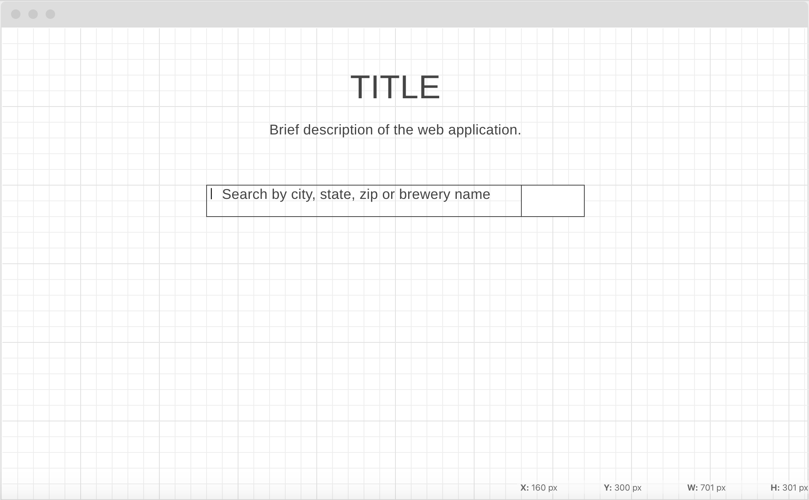
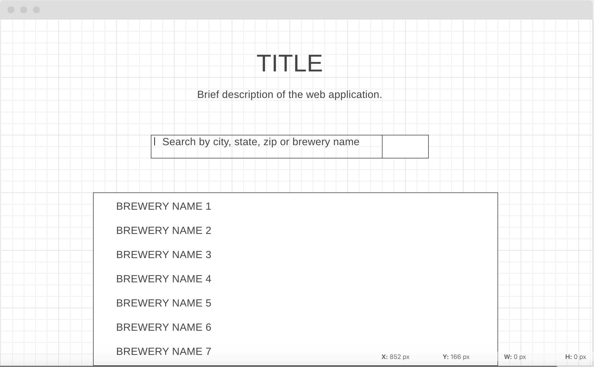
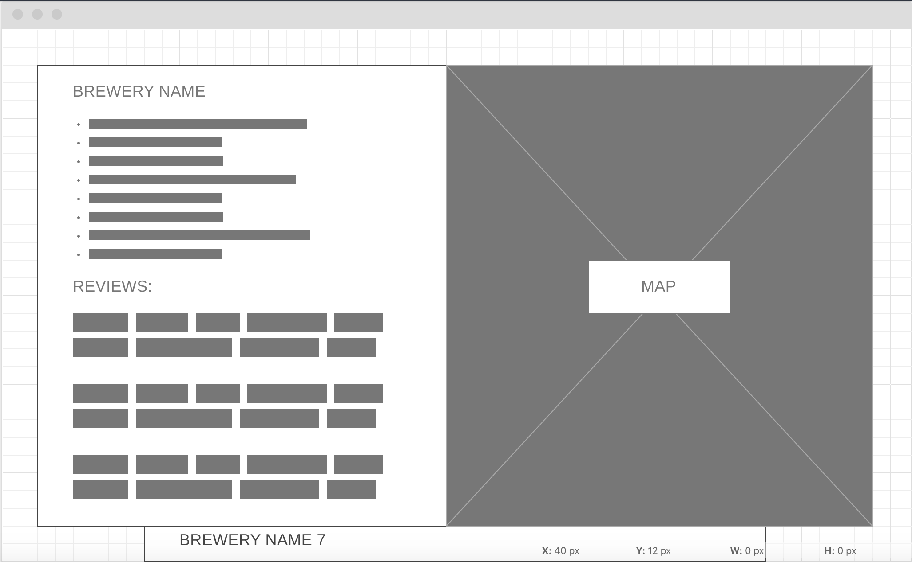

# projectOne
Title: Brew Me, Brew Around Austin, Brew Winch, Discover Breweries, Brews Around Me, 

## description
Create an application that presents users with breweries and bars that serve beer around their area. We will provide filter option by brewery name, state, city, and zip codes. Application then displays Brewery reviews, website url, address, phone number, hours of operation, small picture of brewery, and location on a map. 

## user story
Story #1

AS a beer enthusiast

I want to find breweries in the location of my choosing

SO THAT I can gain general information about specific breweries 

Story #2

AS a tourist

I want to find a local brewery

So that I can try local beers

## wireframe

## api keys to be used
https://leafletjs.com/

https://www.openbrewerydb.org/

https://www.yelp.com/developers/documentation/v3

## rough breakdown of tasks
Create a landing page with a heading 1, 2 and form submission box with button for searching breweries

Create a results div element that is hidden until it is populated with results

Create  a modal that appears when a result is clicked. Modal has brewery information, reviews, and map location

Set up an ajax GET to get information about breweries from OpenBreweryDB
	Be able to display brewery url, address, and phone number.

Set up an ajax GET to get review information and picture from Yelp fusion API
	Be able to display a reviews of brewery, possibly image of brewery, and hours of operation

Set up an ajax GET to show map location from leaflet API
Make address from OpenBreweryDB link to leaflet to display brewery location on a map
